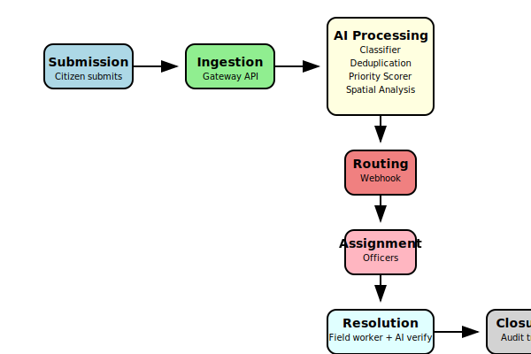
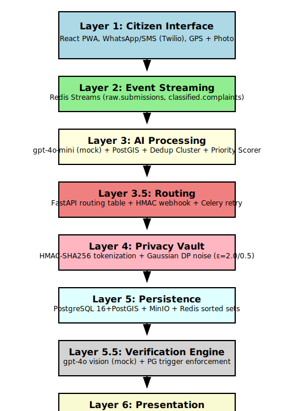

# Smart Problem Classification System

## Overview

The Smart Problem Classification System is a comprehensive platform designed to streamline the reporting, classification, and resolution of civic issues in urban environments. It leverages artificial intelligence, geospatial analysis, and modern web technologies to automatically categorize, prioritize, and route problem reports from citizens to the appropriate municipal departments. The system ensures privacy, verification, and efficient workflow management through a multi-layered architecture.

This project is built with a microservices approach, utilizing Docker for containerization, making it easy to deploy and scale. It includes a citizen-facing Progressive Web App (PWA), department portals, and backend APIs for processing and managing reports.

## Key Features

### 1. **AI-Powered Classification**
   - **Automatic Categorization**: Uses AI models (e.g., GPT-4o-mini) to classify incoming problem reports into predefined categories such as infrastructure, sanitation, utilities, etc.
   - **Intent Detection**: Analyzes text descriptions to understand the nature of the issue.
   - **Mock Mode**: Supports a mock mode for development without requiring API keys, using keyword-based matching.

### 2. **Deduplication and Clustering**
   - **Spatial Deduplication**: Groups similar reports within a 50-meter radius using PostGIS to prevent duplicate submissions.
   - **Cluster Analysis**: Identifies hotspots and patterns in reported issues.

### 3. **Priority Scoring**
   - **Dynamic Scoring**: Calculates priority based on severity, cluster size, upvotes, time sensitivity, weather conditions, and user trust.
   - **Formula**: `score = (severity × 2.5) + (cluster_size × 4) + (upvote_count × 2) + time_age_boost + weather_boost + trust_modifier`
   - **Tiers**: Critical (≥85), High (60-84), Medium (35-59), Low (<35).

### 4. **Geospatial Analysis**
   - **Spatial Processing**: Integrates with PostGIS for location-based analysis and routing.
   - **Map Integration**: Uses Mapbox GL JS for interactive maps in the frontend.

### 5. **Privacy and Security**
   - **User Privacy Protection**: Maintains the privacy of users who report problems by tokenizing citizen identities with HMAC-SHA256 (irreversible without key), applying Gaussian differential privacy noise to GPS coordinates (officers ε=2.0 ±30m, public ε=0.5 ±90m), and ensuring raw GPS is used only for deduplication checks without storing in the database.
   - **Data Anonymization**: Photos are encrypted with AES-256 in MinIO, served via 10-minute pre-signed URLs with 90-day auto-delete TTL.
   - **Secure Routing**: Uses HMAC webhooks for inter-service communication, with webhook payloads containing no PII and only fuzzed GPS data.
   - **Differential Privacy**: Adds noise to protect user data while preserving analytical utility.

### 6. **Two-Step Verification**
   - **Resolution Process**: Requires field workers to upload after-photos and citizens to confirm resolution.
   - **AI Verification**: Compares before/after images with ≥0.80 confidence using vision models.
   - **Database Triggers**: PostgreSQL triggers enforce verification requirements.

### 7. **Multi-Channel Input**
   - **Citizen PWA**: Web app for submitting reports with GPS, photos, and text.
   - **WhatsApp/SMS Integration**: Supports Twilio for messaging-based submissions.
   - **API Endpoints**: RESTful APIs for programmatic access.

### 8. **Real-Time Notifications and Routing**
   - **Event Streaming**: Uses Redis Streams for real-time processing.
   - **Webhook Routing**: Routes reports to departments based on category and location.
   - **Notifications**: Sends updates via email, SMS, or in-app notifications.

### 9. **Department and Admin Portals**
   - **Officer Dashboard**: Interactive map and ticket management for field workers.
   - **Admin Dashboard**: Oversight and analytics for administrators.
   - **Live Updates**: Socket.io for real-time status updates.

### 10. **Scalable Architecture**
   - **Microservices**: Modular backend services (Gateway, Routing, Verification, AI Pipeline).
   - **Containerization**: Docker Compose for easy deployment.
   - **Databases**: PostgreSQL with PostGIS, Redis, MinIO for object storage.

## How It Works

### Workflow Overview
1. **Submission**: Citizens submit problems via the PWA, WhatsApp, or API, including description, location, and photos.
2. **Ingestion**: The Gateway API receives submissions and streams them to Redis.
3. **AI Processing**:
   - Classifier categorizes the issue.
   - Deduplication checks for nearby similar reports.
   - Priority scorer assigns a score.
   - Spatial analysis determines routing.
4. **Routing**: Based on category and ward, routes to the appropriate department via webhooks.
5. **Assignment**: Department officers receive notifications and assign to field workers.
6. **Resolution**:
   - Field worker addresses the issue and uploads after-photo.
   - AI verifies the resolution.
   - Citizen receives notification to confirm.
7. **Closure**: Once confirmed, the ticket is marked resolved with an audit trail.



### Data Flow
- **Layer 1 (Citizen Interface)**: Input collection.
- **Layer 2 (Event Streaming)**: Redis Streams for queuing.
- **Layer 3 (AI Processing)**: Classification, dedup, priority, spatial.
- **Layer 3.5 (Routing)**: FastAPI routing with Celery retries.
- **Layer 4 (Privacy Vault)**: Data anonymization.
- **Layer 5 (Persistence)**: Storage in PostgreSQL, MinIO, Redis.
- **Layer 5.5 (Verification Engine)**: AI vision checks.
- **Layer 6 (Presentation)**: Frontend dashboards.



### Technologies Used
- **Backend**: Python (FastAPI), Node.js (Express)
- **Frontend**: React, Vite, Mapbox GL JS
- **Databases**: PostgreSQL, PostGIS, Redis, MinIO
- **AI/ML**: OpenAI GPT-4o, Vision models
- **Infrastructure**: Docker, Docker Compose
- **Communication**: Socket.io, Twilio, Webhooks

## Quick Start

### Prerequisites
- Docker and Docker Compose
- Git

### Installation
1. Clone the repository:
   ```bash
   git clone https://github.com/princ3kr/City-Sync.git
   cd smart-problem-classification
   ```

2. Copy environment file:
   ```bash
   cp .env.example .env
   ```

3. Start with Docker:
   ```bash
   docker-compose up --build
   ```

   Or use the PowerShell script:
   ```powershell
   .\start.ps1
   ```

### Service URLs
- Citizen PWA: http://localhost:5173
- Gateway API Docs: http://localhost:8000/docs
- Routing API Docs: http://localhost:8001/docs
- Verification API Docs: http://localhost:8002/docs
- Department Portal: http://localhost:3000
- MinIO Console: http://localhost:9001 (user: citysync_minio, pass: citysync_minio_secret)
- PostgreSQL: localhost:5432 (db: citysync, user: citysync, pass: citysync_secret)
- Redis: localhost:6379

## Configuration
- Set `MOCK_AI=true` for development (default).
- For production, set `MOCK_AI=false` and provide `OPENAI_API_KEY`.

## Database Schema

| Table | Purpose |
|-------|---------|
| `tickets` | Core ticket data with triggers. |
| `ticket_clusters` | Deduplication clusters. |
| `department_routes` | Routing rules. |
| `severity_overrides` | Emergency overrides. |
| `verification_submissions` | Verification records. |
| `resolution_log` | Audit trail. |
| `webhook_log` | Every outbound webhook attempt. |
| `model_calls` | AI model call log (replaces MLflow). |

## Contributing
1. Fork the repository.
2. Create a feature branch.
3. Make changes and test.
4. Submit a pull request.

## License

This project is licensed under the MIT License - see the [LICENSE](LICENSE) file for details.

## Contact

For issues, questions, or contributions, please visit the GitHub repository: [https://github.com/princ3kr/City-Sync](https://github.com/princ3kr/City-Sync)

## Privacy

- Citizen identity → HMAC-SHA256 tokenized (irreversible without key)
- GPS coordinates → Gaussian DP noise: officers ε=2.0 (±30m), public ε=0.5 (±90m)
- Raw GPS used only for dedup cluster check, never written to DB
- Photos → AES-256 in MinIO, 10-min pre-signed URLs, 90-day TTL auto-delete
- Webhook payloads → no PII, fuzzed GPS only

- Demo (Live on render): https://city-sync-frontend.onrender.com
